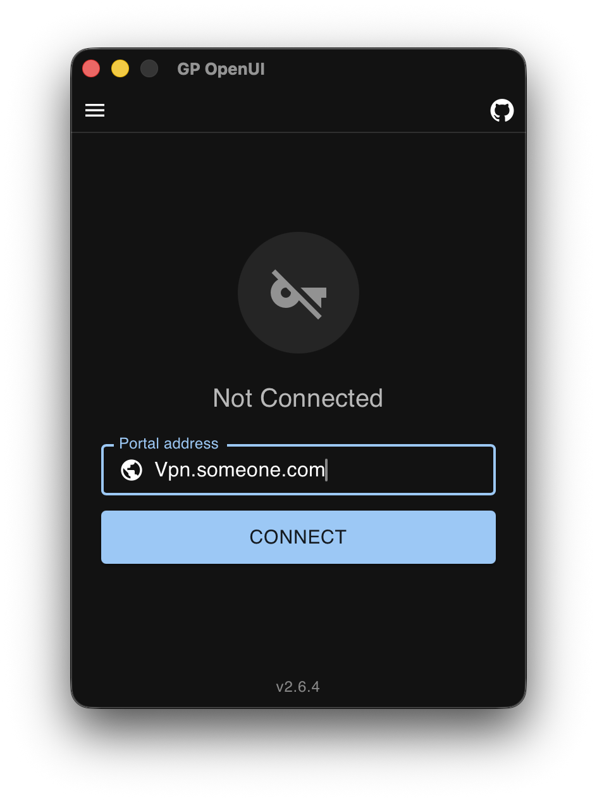

# GP OpenUI
A free, open-source macOS GUI for [GlobalProtect VPNs](https://www.paloaltonetworks.com/network-security/globalprotect). Built with [Tauri](https://tauri.app) (Rust + React).

> **ℹ️ This project originated as a fork** of [MagiShira/globalprotect-openconnect-openui](https://github.com/MagiShira/globalprotect-openconnect-openui), which provides the Linux front-end for the upstream GlobalProtect-openconnect project. This fork adds macOS support by spawning `openconnect` directly instead of relying on the Linux-only `gpservice` daemon, and is now the primary macOS client for GlobalProtect-openconnect.

> **Note:** The official GlobalProtect GUI (`gpgui`) from the upstream project recently added a paywall. This project is an unaffected open-source alternative.

> **Disclaimer:** This is an unofficial third-party client and is not affiliated with or endorsed by Palo Alto Networks. GlobalProtect is a registered trademark of Palo Alto Networks.

## Security Model

A common question: *Does GlobalProtect enforce security policies on my machine after I connect?*

**No.** GlobalProtect — like all SSL VPNs — is a **layer 3 tunnel** (IP packets through a virtual network interface). The server cannot:

- Execute code or scan files on your machine
- Verify what VPN client binary you're running
- Enforce post-connect host compliance

### About HIP (Host Information Profile)

HIP is real, and it's worth being precise about it, because there are two different modes:

1. **Agentless HIP (the common case)** — during the login handshake, the portal sends an XML profile asking the client to *report* its posture: OS, anti-virus, disk encryption, firewall state. The client answers, and the gateway enforces based on that **self-reported answer**. There is no host inspection — the server only sees whatever the client claims. This is the mode an open-source client participates in: it simply reports a compliant posture.

2. **Agent-based HIP (official GlobalProtect agent only)** — newer deployments push a background agent that collects *real* host data (file hashes, running AV) and submits a HIP report. Crucially, this agent runs **on your machine, on its own initiative**, and re-checks only when *it* decides to. The server can *request* a re-check but has no channel to force one — remove the agent, and there is nothing left for the server to enforce against.

**The key point:** HIP enforcement lives entirely in either (a) the self-reported handshake, or (b) a client-side agent you'd have to be running yourself. The server has **no mechanism to inspect or control your host mid-session**. 

**GP OpenUI's own capabilities:** this client supports **agentless HIP** — it submits a self-reported HIP report during connect (with an optional custom script, see Settings). It does **not** include or run a GlobalProtect agent: nothing collects host data in the background, and no periodic posture re-checks happen while connected. The agent-based HIP mode simply does not apply, because there is no agent to enforce.

The official client and this open-source implementation both complete the same GP protocol handshake (portal prelogin, SAML/SSO login, gateway authentication). **There is no binary attestation in the GP protocol** — the server trusts what the client reports.

Once the tunnel is established, the only controls the VPN gateway has are standard: route policies, DNS assignment, ACLs, and session timeouts. These apply equally regardless of which VPN software you use.

<p align="center">
  
</p>

## About

GP OpenUI is a Tauri-based GUI for GlobalProtect VPNs on **macOS** (with Linux support via the upstream daemon stack).

On macOS, it replaces the entire GlobalProtect client: it handles SAML/SSO browser authentication and then spawns the Homebrew `openconnect` binary for the VPN tunnel — no proprietary daemon required.

### Why?

The upstream GlobalProtect-openconnect project's `gpgui` binary is both proprietary and now paywalled. For a VPN client handling your credentials and network traffic, that matters. GP OpenUI is [free software](https://www.fsf.org/about/what-is-free-software).

## Features

- **Password authentication** — standard username/password login
- **SSO/SAML authentication** — opens your default browser for login (works with Okta, Azure AD, PingID, etc.)
- **Client certificate authentication** — PKCS#8 (`.pem`) and PKCS#12 (`.p12`/`.pfx`)
- **Cookie reuse** — stay logged in across SAML sessions
- **OS spoofing** — present as Linux, Windows, or macOS to the portal
- **HIP report submission** — with optional custom script path
- **Tunnel options** — disable IPv6, disable DTLS, custom MTU, VPNC script, reconnect timeout
- **Theme support** — light, dark, and system-follow modes
- **Settings window** — persistent per-user settings stored locally
- **System tray** — minimize to tray with connection status and quick controls
- **Native macOS bundle** — distributable `.app` with the standard macOS auth dialog for privilege escalation

## Roadmap

- [ ] **Manual gateway selection** — the app currently auto-selects the first gateway returned by the portal
- [x] **System tray integration** — minimize to tray, tray icon menu
- [ ] **Auto-start on login** — launch with the system and connect automatically
- [ ] **Resume on wake** — reconnect automatically after the system wakes from sleep

## Installation

### macOS

**macOS users** can either [download the latest release](https://github.com/house-of-stark/globalprotect-openui/releases/latest) (just unzip and run) or build from source:

### Option A: Quick Install (Pre-built Release)

1. Download `GP.OpenUI_*.dmg` from the [latest release](https://github.com/house-of-stark/globalprotect-openui/releases/latest), open it, and drag `GP OpenUI.app` to Applications

   > **Note:** The app is unsigned (no Apple Developer signing). The first time you open it, Gatekeeper may say the developer cannot be verified. Right-click → Open, or run:
   > ```bash
   > xattr -dr com.apple.quarantine /Applications/GP\ OpenUI.app
   > ```
3. Install prerequisites:

   ```bash
   brew install openconnect
   ```

4. **SAML/SSO authentication** requires the `gpauth` binary. Build it from the upstream project:

   ```bash
   git clone https://github.com/yuezk/GlobalProtect-openconnect /tmp/gp-upstream
   cd /tmp/gp-upstream
   rm -f rust-toolchain.toml
   cargo build --release -p gpauth --no-default-features
   sudo install -m 755 target/release/gpauth /opt/homebrew/bin/gpauth
   ```

5. Launch `GP OpenUI.app` from Applications

### Option B: Build from Source

**Prerequisites:** Homebrew, Xcode Command Line Tools (`xcode-select --install`), Rust, Node.js, pnpm, and `openconnect`:

```bash
brew install openconnect
```

**SAML/SSO authentication** requires the `gpauth` binary from the upstream [GlobalProtect-openconnect](https://github.com/yuezk/GlobalProtect-openconnect) project. Build it first:

```bash
git clone https://github.com/yuezk/GlobalProtect-openconnect /tmp/gp-upstream
cd /tmp/gp-upstream
# Remove pinned toolchain to use your system Rust
rm -f rust-toolchain.toml
# Build with SAML support only (no webview dependency)
cargo build --release -p gpauth --no-default-features
sudo install -m 755 target/release/gpauth /opt/homebrew/bin/gpauth
```

Then run the install script:

```bash
./install.sh
```

The script will:

1. Verify Xcode CLI tools are installed
2. Install Rust (≥ 1.85) via `rustup` if not already present
3. Install Node.js LTS and pnpm if not already present
4. Build this Tauri app (`pnpm install` + `cargo tauri build`)
5. Install the `gpgui` binary to `/usr/local/bin/`

> **Note:** The upstream `GlobalProtect-openconnect` daemon (`gpservice`/`gpclient`) is **not required on macOS**. This app uses `openconnect` directly for the VPN tunnel (available via `brew install openconnect`).

To run directly from the build:

```bash
open src-tauri/target/release/bundle/macos/GP\ OpenUI.app
```

### Linux

See the [original repo](https://github.com/MagiShira/globalprotect-openconnect-openui) for Linux installation instructions.

## Usage

### macOS

Launch from your Applications folder, or via:

```bash
open src-tauri/target/release/bundle/macos/GP\ OpenUI.app
```

Or run the CLI binary directly:

```bash
/usr/local/bin/gpgui
```

### Linux

Launch through your application launcher or via:

```bash
gpclient launch-gui
```

### Legacy TLS Configurations

Some GlobalProtect installations use older TLS configurations (e.g. deprecated ciphers or older protocol versions) that are rejected by the system OpenSSL by default. If the GUI fails to connect with a TLS handshake error, use the `--fix-openssl` flag (Linux only):

```bash
gpclient --fix-openssl launch-gui
```


## Requirements

- **macOS:** Apple Silicon or Intel, macOS 13+, Homebrew with `openconnect` installed
- **Linux:** X11 or Wayland, with `apt`, `dnf`, or `pacman`
- Internet access to download build tools
- The `gpauth` binary must exist at `/opt/homebrew/bin/gpauth` (built from the upstream [GlobalProtect-openconnect](https://github.com/yuezk/GlobalProtect-openconnect) project) for SAML/SSO browser authentication

## License

GPL-2.0

